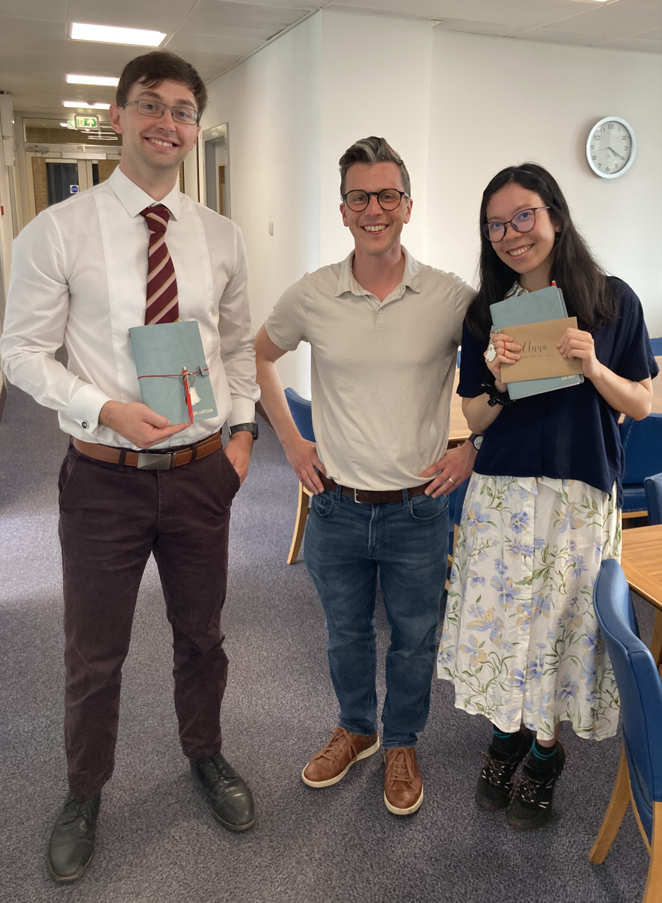
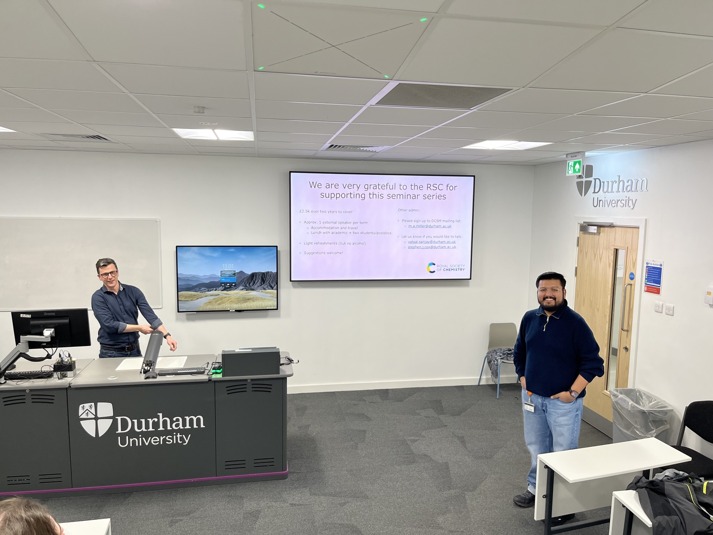
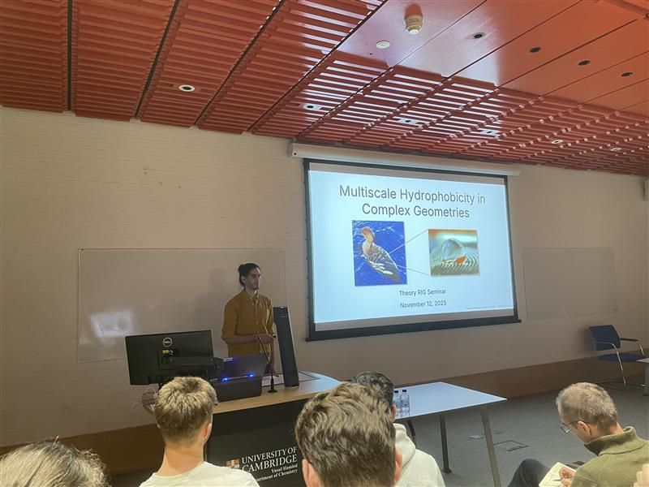

#+TITLE: Cox Group News
#+OPTIONS: num:nil toc:nil title:nil

* 2026

#+begin_news
*Anna's paper on /ab initio/ multiscale modeling of liquids published in PNAS* /(24 July 2026)/

Delighted that Anna's paper /A unified machine-learning framework for
ab initio multiscale modeling of liquids/ has been accepted in
[[https://www.pnas.org/doi/10.1073/pnas.2610049123][Proc. Natl. Acad. Sci. USA]]!

In this work, we combine machine-learned interatomic potentials with
neural classical density functional theory to bridge atomistic and
continuum descriptions of liquids across length scales. Using this
framework, we predict /entirely from first principles/ how confinement
modifies liquid-vapour coexistence in water, while also capturing the
complex behaviour of supercritical carbon dioxide. These phenomena
underpin technologies ranging from carbon capture and sustainable
power generation to chemical separation and extraction.
#+end_news

#+begin_news
*Steve promoted to Associate Professor* /(1 July 2026)/

Steve has been promoted from Assistant to Associate Professor. He's
very grateful to all the support he's had from colleagues in Durham
over the past two years, and, of course, his group for all the
fantastic science they are doing!
#+end_news

#+begin_news
*Anna and John pass their PhD vivas!* /(19 June 2026)/

We're delighted that both Anna and John passed their PhD vivas this week!

#+ATTR_HTML: :alt Image of Anna, John, and supervisor Steve Cox.

/Anna Bui and John Hayton with Steve Cox - congratulations to both!/

Anna's work has focused on developing (and applying) classical density
functional theory to better understand how complex liquids behave
across length scales. In addition, she has made significant
contributions to our understanding of interfacial friction between
water and graphitic surfaces.

John has been tackling the kinetics of crystal growth, with a
particular emphasis on polar crystal surfaces. He has identified the
rate-limiting step of crystal growth at NaCl (111), which he hopes to
publish soon.

We're very proud of both Dr Bui and Dr Hayton!
#+end_news

#+begin_news
*Anna's paper on dielectrocapillarity accepted in Nature Communications* /(24 February 2026)/

Excited that Anna's paper /Dielectrocapillarity for exquisite control
of fluids/ has been accepted in [[https://www.nature.com/articles/s41467-026-69482-1][Nature Communications]]!

In this work, we combine state-of-the-art advances in liquid state
theory with deep learning to uncover how electric field gradients
enable tunable control of fluids at the nanoscale.

Check out our [[file:research.org][research pages]] for more info.
#+end_news

#+begin_news
*Katie's paper on selective adsorption live on arXiv* /(4 February 2026)/

First and foremost --- well done to Katie for writing her [[https://arxiv.org/abs/2601.21591][first paper]]!

In this paper, we show how the hyper‑DFT approach to mean‑field theory
[[https://iopscience.iop.org/article/10.1088/1361-648X/ade7e7/pdf][(see our previous work)]] can be used for a "train once, learn many"
strategy, greatly simplifying the machine‑learning component of neural
cDFT. In particular, we demonstrate how the properties of a binary
fluid can be investigated by learning the free‑energy functional only
for a repulsive single‑component reference system.

But this paper is more than a methodological development. We find that the presence of an azeotrope in the fluid's phase diagram influences adsorption under thermodynamic conditions far from liquid–vapour coexistence. We also show that adsorption is the thermodynamic driving force for pore selectivity, and that a completely unselective state corresponds to an extremum in the surface tension.
#+end_news

#+begin_news
*Steve gives talk to kick off /SoftForm/ seminar series* /(15 January 2026)/

This week, Steve presented the first in a new series of soft matter
seminars in Durham. His talk, entitled 'Toward first-principles
modeling of fluids across length scales', presented insightful
research of relevance to soft matter researchers in both the chemistry
and physics departments in Durham.

#+ATTR_HTML: :alt Image of Steve presenting the talk.

/Steve (left) presenting his talk, chaired by Vatsal Sanjay (right), a
soft matter researcher from the Durham University Physics Department./

This new seminar series, titled SoftForm, will run throughout 2026,
comprising fortnightly talks presented by a broad range of external
and internal speakers. We are grateful to the Royal Society of
Chemistry for funding this exciting new opportunity to collaborate and
share our research!
#+end_news

* 2025

#+begin_news
*Alex gives /Theory RIG/ seminar in Cambridge* /(18 November 2025)/

Alex gave an invited talk to the Theory Research Interest Group in
Cambridge --- congratulations!

#+ATTR_HTML: :alt Image of Alex presenting the talk

/Alex demonstrating hydrophobcity with ducks!/

The talk focused on Alex's work using classical density functional
theory to understand hydrophobicity in complex geometries. This
research has broad relevance, from interpreting liquid-state AFM
measurements to understanding mechanisms in biological systems.
#+end_news

#+begin_news
*Prizes for Anna and Fiona!* /(9 October 2025)/

Big congratulations to Anna and Fiona for winning prizes at the Theory
RIG Showcase Day in Cambridge!

Anna won the Best Talk Prize for her presentation on learning free
energy functionals for ionic and polar fluids.

Fiona won the Best Poster Prize for her work on understanding mixtures
of carbon dioxide and nitrogen under confinement.

This continues a run of successes for Cox Group members, with Alex and
Connie also winning conference poster prizes over the past year.
#+end_news

#+begin_news
*Welcome Edward, Jan, and Sandro!* /(7 October 2025)/

A very warm welcome to our new group members, Edward Cecil, Jan
Vavrin, and Sandro Sanadiradze!

Jan joins us from the University of Cambridge and will be aiming to
understand the behavior of ions at the air-water interface ---
including doing some experiments!

Edward loves Durham so much he decided to stay, and will be working on
electromechanics in liquid crystals.

Sandro, currently in his final year at Durham, is undertaking his
MChem project on dielectrocapillarity.
#+end_news
