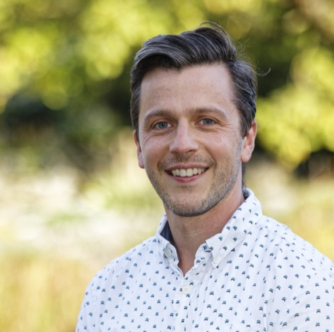
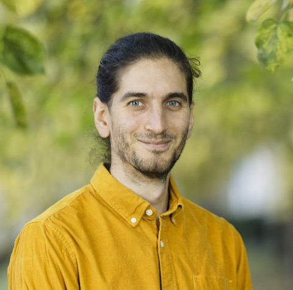
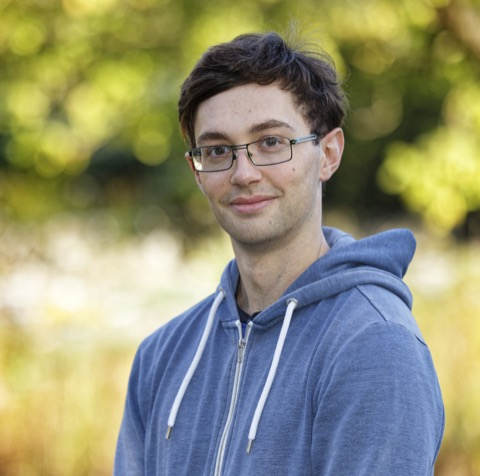
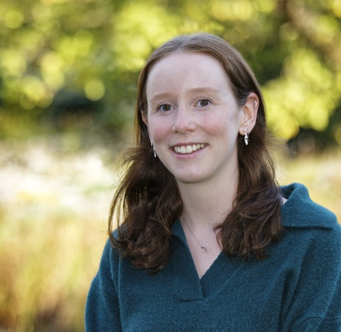
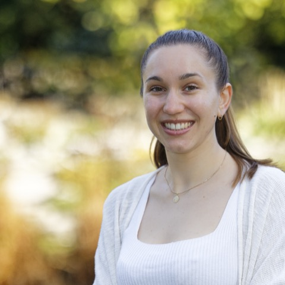
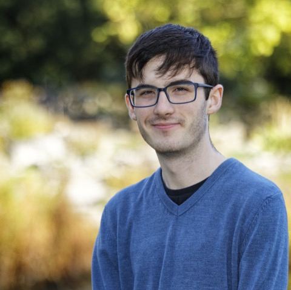
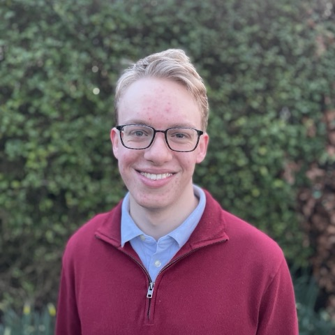
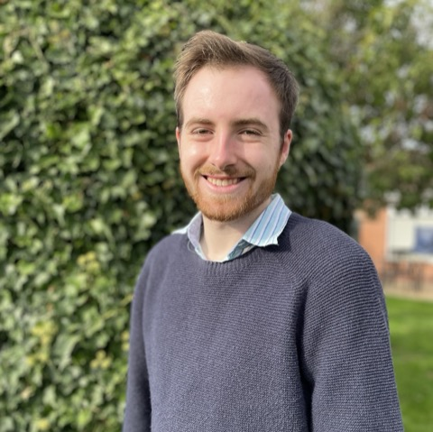

#+TITLE: Cox Group Members
#+DESCRIPTION: Meet the researchers in the Cox Group at Durham University, working on classical density functional theory and machine learning for liquids at interfaces.
#+OPTIONS: num:nil toc:nil
#+HTML_HEAD_EXTRA: <meta property="og:type" content="website">
#+HTML_HEAD_EXTRA: <meta property="og:title" content="Cox Group Members">
#+HTML_HEAD_EXTRA: <meta property="og:description" content="Meet the researchers in the Cox Group at Durham University, working on classical density functional theory and machine learning for liquids at interfaces.">
#+HTML_HEAD_EXTRA: <meta property="og:url" content="https://coxgroup.github.io/people.html">
#+HTML_HEAD_EXTRA: <meta property="og:image" content="https://coxgroup.github.io/images/group.png">
#+HTML_HEAD_EXTRA: <meta name="twitter:card" content="summary_large_image">

* Current group members

#+begin_people-grid
#+begin_person
#+ATTR_HTML: :alt Stephen Cox :class person-photo :width 160

*Stephen Cox* \\
Royal Society University Research Fellow and Associate Professor

[[mailto:stephen.j.cox@durham.ac.uk][Email]] ⋅ [[https://orcid.org/0000-0003-2708-8711][ORCID]]
#+end_person

#+begin_person
#+ATTR_HTML: :alt Alex Epstein :class person-photo :width 160

*Alex Epstein* \\
Postdoctoral Research Associate

[[mailto:alexander.r.epstein@durham.ac.uk][Email]]
#+end_person

#+begin_person
#+ATTR_HTML: :alt John Hayton :class person-photo :width 160

*John Hayton* \\
PhD Student

[[mailto:jah260@cam.ac.uk][Email]]
#+end_person

#+begin_person
#+ATTR_HTML: :alt Connie Fairchild :class person-photo :width 160

*Connie Fairchild* \\
PhD Student

[[mailto:cf497@cam.ac.uk][Email]]
#+end_person

#+begin_person
#+ATTR_HTML: :alt Fiona Baumhauer :class person-photo :width 160

*Fiona Baumhauer* \\
PhD Student

[[mailto:fb590@cam.ac.uk][Email]]
#+end_person

#+begin_person
#+ATTR_HTML: :alt Dom Thomas :class person-photo :width 160

*Dom Thomas* \\
PhD Student

[[mailto:dominic.p.thomas@durham.ac.uk][Email]]
#+end_person

#+begin_person
#+ATTR_HTML: :alt Jan Vavrin :class person-photo :width 160

*Jan Vavřín* \\
PhD Student

[[mailto:jan.vavrin@durham.ac.uk][Email]]
#+end_person

#+begin_person
#+ATTR_HTML: :alt Edward Cecil :class person-photo :width 160

*Edward Cecil* \\
PhD Student

[[mailto:edward.j.cecil@durham.ac.uk][Email]]
#+end_person
#+end_people-grid

* Alumni

- *Dr. Anna Bui* (2021-2026) - PhD student, now Stanford Science Fellow at Stanford University
- *Dr. Amir Hajibabaei* (2022-2024) - postdoc, now at Microsoft Research
- *Rebecca Driver* (2024) - summer student, now PhD at King's College London
- *Katie Zhou* (2025) - MChem student, now PhD at University of Liverpool
- *Sandro Sanadiradze* (2026) - MChem student, now PhD at University of Cambridge
  
