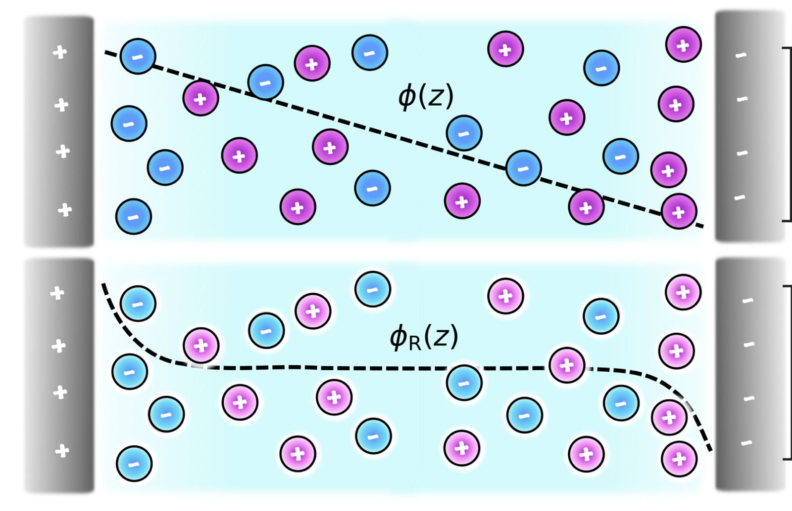
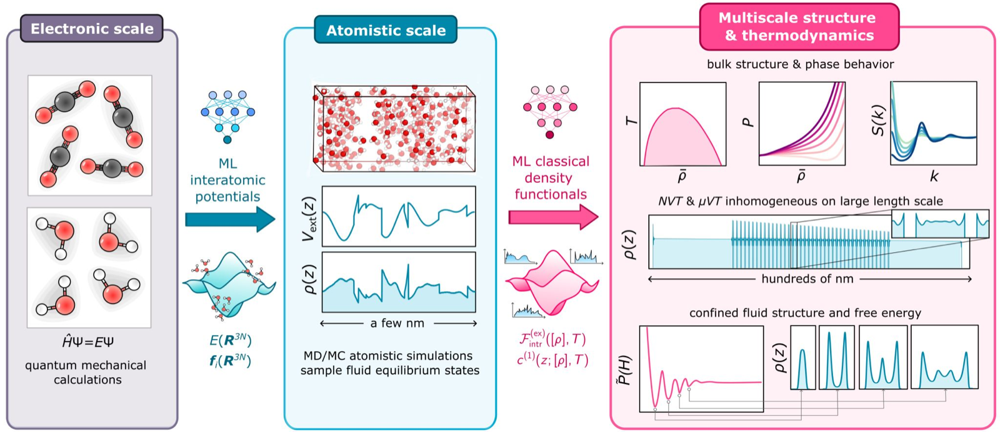
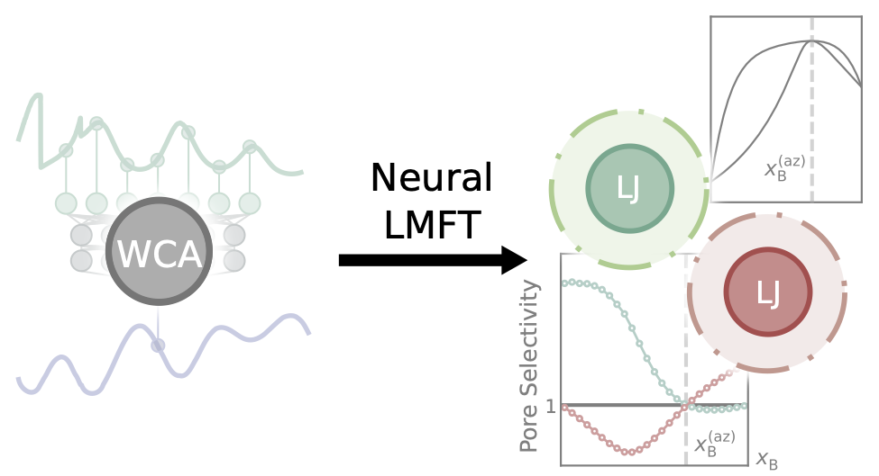
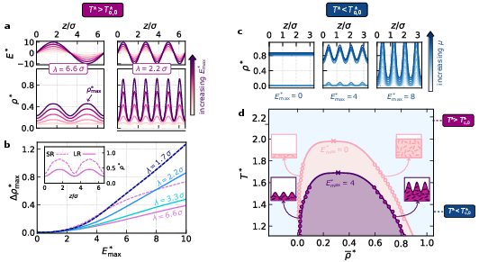
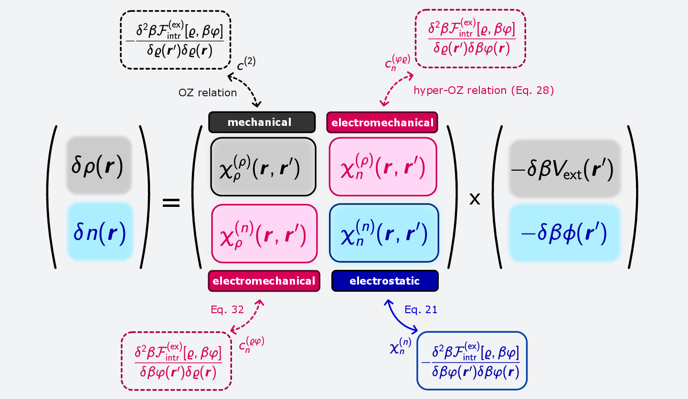
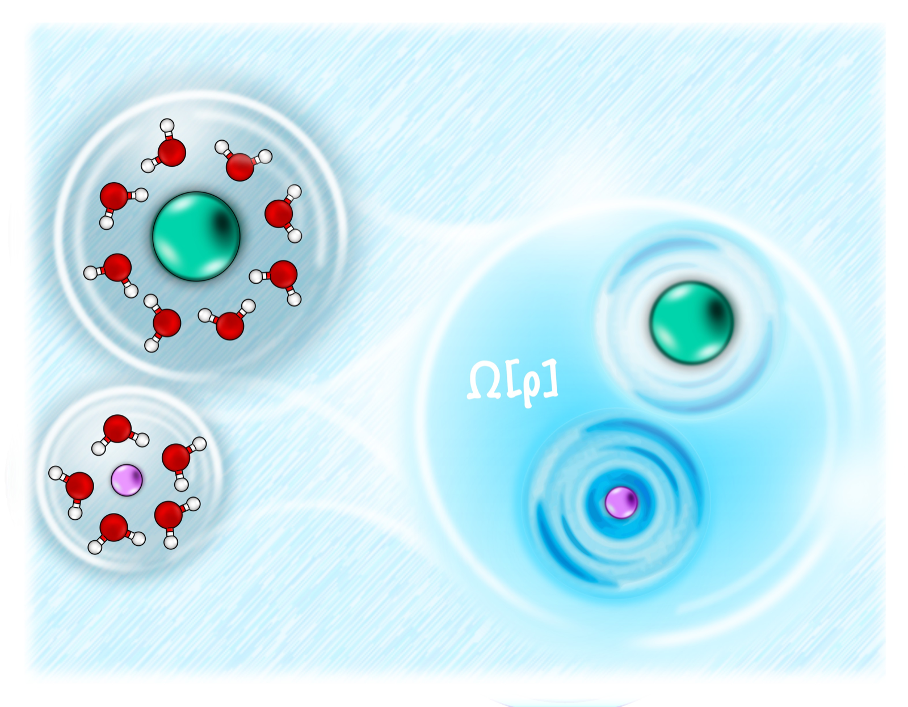
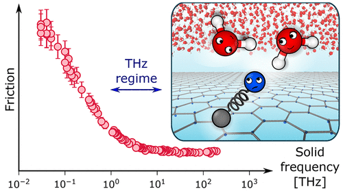
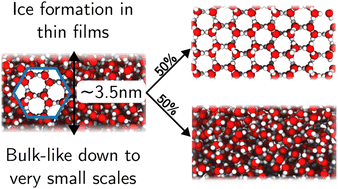

#+TITLE: Cox Group Research
#+OPTIONS: num:nil toc:nil title:nil

Our group has played a leading role in developing *neural classical
density functional theory (neural cDFT)* for complex, molecular
liquids — using machine learning not to replace physical theory, but
to learn the free-energy functionals that cDFT needs, directly from
simulation data. Not only does this allow to investigate systems on
much larger length scales than possible with molecular simulations,
but we can easily model systems in open equilibrium with a
reservoir. An additional payoff is that neural cDFT is anchored in
exact statistical mechanics; we do not need to assume /ad hoc/
constitutive relations to gain conceptual understanding. 

We're now applying this machinery to a range of systems where getting
the microscopic physics right actually matters for macroscopic
behaviour.

Check out our [[file:publications.org][publications]]!

** Neural cDFT for complex liquids

This is the methodological core of what we do. Starting from
relatively inexpensive simulation data, we learn free-energy
functionals for "complex" liquids — where complexity can arise from
long-ranged interactions, nontrivial molecular geometry, or chemical
composition — far beyond where they were trained. This avoids
hand-picking a closed-form functional that only works for simple
fluids, while ensuring that the ML model remains rooted in a solid
theoretical framework.

#+begin_paper-link

See [[https://journals.aps.org/prl/pdf/10.1103/PhysRevLett.134.148001][Learning classical density functionals for ionic fluids]].
#+end_paper-link

#+begin_paper-link

See [[https://www.pnas.org/doi/10.1073/pnas.2610049123][A unified machine-learning framework for ab initio multiscale modeling of liquids]].
#+end_paper-link

** Chemical separation

Confined mixtures can behave very differently from their bulk
counterparts, and we're using cDFT to understand *why* - what actually
drives selectivity in a pore, and when bulk thermodynamic intuition
(like the location of an azeotrope) breaks down or persists under
confinement.

#+begin_paper-link

See [[https://pubs.acs.org/doi/full/10.1021/acs.jpcb.6c00640][Roles of Bulk and Surface Thermodynamics in the Selective Adsorption of a Confined Azeotropic Mixture]].
#+end_paper-link

** Device engineering: fields and dielectric response

Liquids respond to applied fields in ways that are still poorly
captured by standard theory - and that response is exactly what you'd
want to exploit or control in a device. We're building toward
applications like blue energy cycles, where field- and
concentration-gradients drive useful work from a liquid, by first
getting the fundamental field response right.

#+begin_paper-link

See [[https://www.nature.com/articles/s41467-026-69482-1][Dielectrocapillarity for exquisite control of fluids]].
#+end_paper-link

#+begin_paper-link

See [[https://iopscience.iop.org/article/10.1088/1361-648X/ade7e7/meta][A first-principles approach to electromechanics in liquids]].
#+end_paper-link

** Solvation

How a solute reshapes the liquid around it, across length scales,
determines everything from reaction rates to ion transport. We use
cDFT to describe solvation without the usual simplifying assumptions
about dielectric response or ion size, so the same framework holds
from the molecular scale up.

#+begin_paper-link

See [[https://doi.org/10.1063/5.0223750][A classical density functional theory for solvation across length scales]].
#+end_paper-link

** Interfacial dynamics

Alongside this, we've contributed to a broader set of questions around
how liquids behave dynamically at crystal and confined interfaces -
including ice nucleation, salt dissolution and crystallization, and
friction at water-carbon interfaces. This isn't a primary focus of the
group, but it's shaped how we think about liquid-solid interfaces.

#+begin_paper-link

See [[https://doi.org/10.1021/acs.nanolett.2c04187][Classical Quantum Friction at Water-Carbon Interfaces]]
#+end_paper-link

#+begin_paper-link

See [[https://doi.org/10.1039/D3FD00099K][The limit of macroscopic homogeneous ice nucleation at the nanoscale]]
#+end_paper-link

